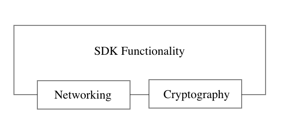

 

  

  

    <i>Guidelines and resources for building Flow SDKs and client libraries</i>
     
    <a href="https://github.com/onflow/sdks/pulls"><strong>Suggest a Guideline»</strong></a>
     
     
    <a href="https://github.com/onflow/flow-emulator/issues">Suggest a Change</a>
    ·
    <a href="https://github.com/onflow/flow-emulator/blob/master/CONTRIBUTING.md">Contribute</a>
  

 
 

_This repository defines guidelines for building Flow SDKs. It's still work in progress. It aims to help you build and maintain a high-quality Flow SDK._

The guidelines will help you build SDKs that will be:

### **Consistent**

Usage of ubiquitous language, supporting same user stories, common versioning will bring consistency across SDKs. Consistency is important as it brings familiarity between implementations, easier transitions, and a common practice for implementations. 

### **Accessible**

Accessibility is an important aspect of each SDK and it means how easy is for a developer to start using and implementing the SDK. Great documentation makes SDK more accessible. The guidelines define rules around the documentation and also example templates to write it. 

### **Reliable**

Reliability is of the highest importance for any piece of software. It is achieved by having good tests, but also and almost more importantly common rules around handling changes, and backward compatibility, since the SDK is not meant to act as a standalone product but as an integrated part in another product it is important that it doesn't break that piece of software. Changes are inevitable and we will provide guidance on how to tackle them without hurting anyone.

### **Community-driven**

We want SDKs to live and be owned by the community. We want them to evolve with the community usage and not be biased with our view of the problems.

# Process

We have divided the SDK implementation process into multiple steps. You can go through each step as you build your own SDK.

## Design

SDK should provide good isolation between domain functionalities, we believe that networking and cryptography shouldn't be implemented by you, but instead provide a common interface and leverage good and secure implementation of the third-party SDKs. There are multiple reasons behind this architectural decision:

- **security** - implementing your own cryptography functions can be too complex which might lead to mistakes that will be costly.
- **complexity** - leverage work from other libraries and this way lower the friction for implementing the SDK
- **maintainability** - cryptography operations can change and it is important to stay on top of those changes
- **testability** - isolating networking layer will give you an easier option to swap that part during testing with a mock implementation

    

When designing an SDK interface it is advisable you follow our ubiquitous language, this will achieve the goal of consistency. You can read about the ubiquitous language here: 

[SDK Ubiquitous Language [WIP]](ubiquitous-language.md)

Implementation of the SDK can implement arbitrary feature domains. A feature domain is a set of related features that define a common interface. Each language-specific implementation of the SDK can implement an arbitrary set of feature domains and be advertised as such thus removing the idea of one SDK per language to rule them all. The concepts of implementing different feature domains follow the philosophy of composability and "doing one thing and doing it well".

**Feature Domains [WIP]**

- **SDK** - Implementing access node API
- **FCL** - Wallet discovery

## Implementation

Implementation of the SDK should be done by following user stories. Bellow-defined users stories are your guide to implementing a feature domain and we support you with test data and fixtures.

**[WIP]**

[User Stories WIP](./user-stories.md)

**Networking**

Access nodes currently support two APIs:

- **REST**
    Implementing REST API is recommended. REST API specifications can be found [here](TBD) and you can use a mock REST API for testing found [here](TBD)

- **GRPC**
    Implementing gRPC protocol can be done by using the [protobufs found here](https://github.com/onflow/flow/tree/master/protobuf) and by using [the documentation](https://docs.onflow.org/access-api/)

Communication with access nodes should be contained in a networking module exposing only an interface and thus isolating the implementation from the rest of the SDK. This will allow you to easily test the library with mocking and allowed you to reuse third-party libraries. 

Executing network requests should provide a mechanism to control the request after being sent, this would allow the application using the SDK to cancel the request, set different timeouts, and in general give control to the user. Networking should be implemented in asynchronous or synchronous nature, based on what is idiomatic in the specific language but prefer asynchronous if possible.

**Versioning**

Changes in the codebase should reflect with versioning. We advise using [semantic versioning format](https://semver.org/). Following this versioning format will allow you to comply with other guidelines such as handling breaking changes etc. Once the codebase is stable enough you should establish a release schedule and make sure it always includes all changes from sporking.

**Cadence**

Implementing the above-mentioned user stories will require you to supply the transactions with a cadence code. To avoid making mistakes in the cadence code we advise you to use our templates defined in the repo [TBD]

[Cadence Templates](/templates/cadence)

**Error Handling**

Writing code by exercising [defensive design](https://en.wikipedia.org/wiki/Defensive_design) is a good way to avoid unexpected errors. Handle errors gracefully and in language idiomatic way. Provide the best context as part of the error message as you can, this will allow the user of the SDK to quickly debug the problem. 

**Logging**

Logging is an optional functionality of the SDK and it is meant to be of assistance to the developer implementing your SDK, however, please be careful that logging is implemented as an isolated module and it should be possible to disable it. It is advisable to also use third-party logging libraries which should be plugged into the SDK.

## Testing

Writing good tests is a crucial task in pursuit of reliability. We will assist you with our testing data [TBD] you can use to mock responses for each user story. After implementing unit tests you should add integration tests by using our testing mock APIs found here [TBD]. Mock API exposes the same API interface as the access node and returns mock results which you can assert. 

An SDK could optionally expose the testing functionality thus making it possible for developers using the SDK to switch to mock implementation and test their application easier. (rephrase)

**CI & CD**

Follow best practices in optimizing the integration and deployment workflow. Make sure tests are being run as part of the CI and all released versions of the SDK are passing the tests.

## Documentation

We like to follow the philosophy of tasks not being done until they are documented. Our SDK documentation is built by using example templates in each of the SDK repos. Please provide all code examples with optional comments.

[Documentation Templates [WIP]](/templates/documentation)

**Repository**

Each SDK should have a repository that contains the following documents: readme, contributing, and license. 

**Specifications**

Your SDK should include API specifications. This requirement is to achieve better accessibility as described in the goals section. The codebase should be well-commented code and leverage specification generation tools available for each language. 

## Maintaining

After releasing the first version of your SDK the maintenance period begins. Maintaining an SDK means implementing new features, removing features that are no longer supported and fixing potential bugs, and doing all of that without breaking others people's stuff. This guideline will provide tools and practices you can use during the maintenance period.

**Breaking Changes**

Breaking changes should always be documented, preferably should be part of the PR and it follows. Write the changelogs using the format described here [https://keepachangelog.com/en/1.0.0/](https://keepachangelog.com/en/1.0.0/).

You should communicate changes by providing answers to questions: how it breaks and what are the changes needed.

**Deprecation**

Before a breaking change happens there should be a period announcing the change if possible. After making a change try to support backward compatibility up to a period during which you should output a warning about the change. Try to define this period and keep it the same so developers become familiar with it.

